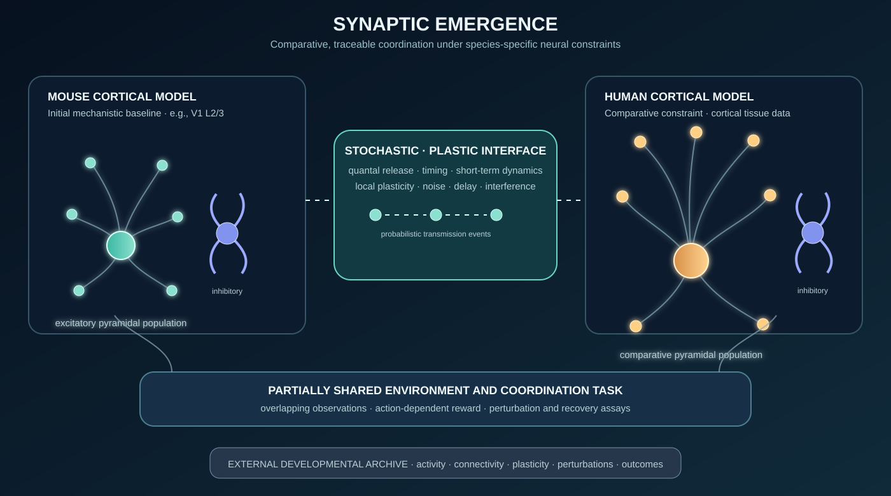

# Neural Accord

> **An open research platform for investigating how adaptive coordination develops, persists, and becomes historically opaque under biologically motivated neural constraints.**



*Conceptual architecture, not an anatomical reconstruction or claim of neuronal scale. The figure distinguishes a mouse cortical baseline and a human cortical comparative model. All quantitative assumptions belong in versioned evidence profiles. The initial experiment suite is named **Synaptic Emergence**.*

## The premise

Neural Accord studies how adaptive systems form and maintain workable coordination when information is bounded, stochastic, state-dependent, and shaped by plasticity. It treats communication, learning, and memory as related problems of retaining action-relevant correlations among activity, environment, and outcome.

The platform progresses through increasingly biological and applied implementations:

1. **Synaptic Emergence** — discrete, bounded, stochastic convention formation.
2. **Dynamic Synapses** — activity-dependent release, delay, facilitation, and depression.
3. **Neural Populations** — recurrent mouse and human cortical population models.
4. **Persistence and Archaeology** — development, maintenance, turnover, perturbation, and recovery of developmental genealogy.
5. **BCI Co-Adaptation** — chronological cross-session evaluation of adaptive neural decoders under limited calibration, drift, and channel loss.

Neural Accord does **not** claim that a symbolic channel is a literal synapse, that it simulates an entire brain, or that it establishes a theory of consciousness. Every model must distinguish what is measured, modeled, abstracted, unknown, and hypothesized.

## Research questions

### Constrained coordination

When systems must coordinate through bounded and unreliable transmission, what strategies emerge: redundancy, distributed coding, structured conventions, repair-like behavior, or collapse?

### Dynamic biological constraints

Do activity-dependent release probability, short-term facilitation/depression, delay, recurrent inhibition, and local plasticity produce coordination regimes that differ from fixed-noise models?

### Unknown common ground

When systems have overlapping but incompletely shared observations, can they learn behavior that marks, avoids, or resolves the boundary of mutual reference without receiving a designer-supplied protocol?

### Maintenance and developmental history

What allows adaptive coordination to survive perturbation, environmental change, and component turnover? Can a system preserve functional consequences of development while its developmental genealogy is more recoverable from an external trace than from its current operative state?

### Cross-species robustness

Which findings survive separately parameterized mouse and human cortical constraints, and which depend on species-specific cellular, synaptic, or circuit organization?

### BCI co-adaptation

Given historical neural recordings and limited labels from a new session, how much current-session calibration is required for an adaptive decoder to regain and maintain a declared closed-loop control threshold? Can biologically motivated stability, uncertainty, and adaptation mechanisms lower that burden relative to task-appropriate competitive baselines?

## Biological target

The initial biological target is **cortical microcircuit dynamics**, not a generic model of “the brain.” Mouse and human evidence are retained in separate profiles; the project never averages them into an undocumented mammalian default.

| Profile | Role | Rationale |
|---|---|---|
| Mouse cortex | Initial mechanistic baseline | Strongest experimentally tractable mammalian foundation for linking cell type, connectivity, synaptic physiology, plasticity, behavior, and perturbation |
| Human cortex | Comparative constraint | Tests transfer rather than assuming mouse is an interchangeable human proxy |
| Comparative profile | Uncertainty and transfer experiments | Holds task and analysis constant while changing documented species constraints |

Comparative cortical datasets show that mouse and human local connectivity and synaptic dynamics differ, while viable human tissue is necessarily more limited than mouse tissue. See [Campagnola et al. (2022)](https://pmc.ncbi.nlm.nih.gov/articles/PMC9970277/) and the [Allen Institute Synaptic Physiology program](https://brain-map.org/our-research/connectivity/synaptic-physiology).

### Fidelity ladder

| Level | Implementation | Permitted conclusion |
|---|---|---|
| 0 — Functional | Discrete events; bounded signaling; erasure and interference; reward-driven adaptation | Computational effects of constrained stochastic communication |
| 1 — Dynamic synapse | State-dependent release; facilitation; depression; delay; parameter distributions | Consequences of modeled synaptic dynamics for Level 0 phenomena |
| 2 — Population code | Spiking/rate populations; probabilistic synapses; inhibition; temporal decoding | Whether phenomena survive without designer-defined symbols |
| 3 — Circuit-specific | Named region, layer, cell types, connectivity, plasticity, and validation targets | A declared circuit model under specified conditions—not a whole-brain model |
| 4 — BCI co-adaptation | Historical neural recordings, limited current-session labels, closed-loop control simulation, and task-specific baselines | Whether an approach lowers calibration burden under declared data and evaluation conditions |

## Constraint map

| Feature | Biological target | Status | Limitation |
|---|---|---|---|
| Discrete event transmission | Quantal neurotransmitter release | `ABSTRACTED` | A token is not a vesicle; a synapse is not a network socket |
| Probabilistic omission | Release failure / unreliable effective transmission | `ABSTRACTED → MODELLED` | Fixed erasure is Level 0 only; later models use state-dependent release |
| Bounded signaling window | Temporal, metabolic, and refractory constraints | `ABSTRACTED` | Neural models use time, spike, and activity budgets rather than message length |
| Facilitation/depression | Activity-history-dependent efficacy | `MODELLED` | Parameters are specific to a named evidence profile and conditions |
| Local plasticity | Activity-dependent synaptic change | `MODELLED / HYPOTHESIS` | No rule is treated as a complete theory of learning or memory |
| SILENCE | Observable erasure for diagnostic control | `ABSTRACTED` | Postsynaptic systems do not receive a labeled notice of a failed release |
| Substitution | Effective interference / decoding ambiguity | `ABSTRACTED` | Neural models use competing activity, timing jitter, and background noise |
| Decoder drift | Changing neural/recording/strategy relationship across sessions | `MEASURED / MODELLED` | BCI implementation requires task-specific real-data validation |

## Hypotheses

- **H1 — Dynamic reliability.** Under some task regimes, state-dependent transmission and limited signaling capacity favor distributed, robust, or redundant coordination relative to a matched fixed-noise baseline.
- **H2 — Boundary sensitivity.** At intermediate private-observation rates, systems develop behavior associated with common-ground boundaries rather than merely ignoring private observations.
- **H3 — Maintenance.** Persistent competence depends on more than static weights; recurrent dynamics, short-term synaptic state, homeostasis, replay, and structural reorganization make separable contributions.
- **H4 — Retention dissociation.** A mature system can preserve useful coordination while its developmental route is more recoverable from a complete external trace than from current operative state.
- **H5 — Cross-species transfer.** Some effects survive mouse/human profile differences; others are sensitive to species-specific parameters or network architecture.
- **H6 — Calibration reduction.** Under chronological cross-session evaluation, an uncertainty-aware co-adaptive method can reach a predeclared control threshold with fewer current-session labels, less prompted time, or faster recovery after drift/channel loss than declared baselines.

## Architecture

```text
mouse evidence profile ─┐
                        ├──► network/channel builder ─► task environment
human evidence profile ─┘              │                       │
                                       │                       ▼
                                       └────► activity + plasticity
                                                         │
                                                         ▼
                                     complete developmental trace
                                                         │
                                                         ▼
        task performance · neural validation · robustness · cross-play
               lineage recovery · uncertainty · cross-species comparison
                                                         │
                                                         ▼
           BCI data adapter · calibration protocol · baseline registry
                                                         │
                                                         ▼
       current-session label burden · closed-loop performance · recovery
```

```text
neural-accord/
├── README.md
├── synaptic-emergence-overview.svg
├── docs/
│   ├── provenance.md
│   ├── biological-constraints.md
│   ├── abstraction-boundaries.md
│   ├── hypotheses.md
│   ├── validation.md
│   └── references.bib
├── core/
│   ├── channels/
│   ├── tasks/
│   ├── traces/
│   ├── metrics/
│   └── reproducibility/
├── profiles/
│   ├── mouse/
│   ├── human/
│   └── comparative/
├── experiments/
│   ├── synaptic_emergence/
│   ├── dynamic_synapse/
│   ├── neural_population/
│   ├── persistence/
│   └── bci_coadaptation/
│       ├── adapters/
│       ├── preprocessing/
│       ├── calibration_protocols/
│       ├── baselines/
│       ├── drift_and_dropout/
│       ├── closed_loop_evaluation/
│       └── reports/
├── configs/
├── tests/
└── notebooks/
```

## How it runs

All experiments are declared in YAML and produce a resolved configuration, deterministic seed manifest, trace, metrics, biological-validation results, and report.

```bash
neural-accord run configs/mouse/v1_l23_dynamic_synapse.yaml --seed 1042
neural-accord bci-evaluate configs/bci/cursor_cross_session.yaml --seed 1042
```

### Biological experiment configuration

```yaml
experiment:
  id: mouse_v1_l23_noise_001
  seed: 1042
  fidelity_level: 1

biology:
  species: mouse
  region: primary_visual_cortex
  cortical_layer: L2_3
  evidence_profile: profiles/mouse/v1_l23.yaml
  parameter_policy: measured_or_explicit_uncertainty

synapse:
  model: tsodyks_markram_dynamic_synapse
  release_probability: sampled_from_profile
  facilitation: enabled
  depression: enabled

learning:
  local_rule: reward_modulated_stdp
  homeostasis: enabled

trace:
  level: full
  checkpoints_every: 1000
```

### BCI calibration experiment configuration

```yaml
experiment:
  id: cursor_cross_session_001
  fidelity_level: 4
  seed: 1042

bci:
  data_source: nwb_or_approved_adapter
  task: cursor_2d
  evaluation: chronological_cross_session
  historical_sessions: [session_01, session_02, session_03]
  current_session: session_04
  features: threshold_crossings_or_spike_rates
  closed_loop_simulation: required

calibration:
  label_budget:
    unit: trials
    values: [0, 5, 10, 25, 50, 100]
  performance_threshold:
    metric: target_acquisition_rate
    value: 0.80
  adaptation_allowed: true

baselines:
  - fixed_historical_decoder
  - current_session_supervised_decoder
  - declared_linear_or_kalman_decoder
  - declared_domain_adaptation_baseline
  - neural_accord_coadaptive_decoder
```

## BCI Co-Adaptation Track

This track exists to make Neural Accord useful to researchers evaluating real brain–computer interface data. It does not assume that simulated neural activity can establish BCI utility.

### Scope

A BCI experiment has two adaptive parties: the user/neural population and the decoder. The relationship between neural features and intended actions can shift across minutes, days, and sessions. The relevant applied objective is therefore not merely high offline accuracy; it is stable, closed-loop control with minimal user-facing recalibration.

The track will provide:

- Adapters for permitted neural datasets, prioritizing NWB where possible.
- A normalized `BCISession` data contract.
- Strict chronological cross-session splits; no random intermixing of future and historical trials.
- Calibration-budget curves rather than a single offline-score report.
- Drift, channel-loss, and signal-quality perturbation protocols.
- Task- and modality-specific baseline registries.
- Closed-loop simulation where task data support it.
- Explicit reporting of uncertainty, adaptation latency, and retention costs.

### BCI session contract

```python
BCISession(
    subject_id,
    session_id,
    task_type,
    neural_features,
    timestamps,
    intended_kinematics,
    decoder_outputs,
    feedback_events,
    channel_metadata,
    recording_quality,
    trial_labels,
    session_conditions,
)
```

### Calibration burden

The primary quantity is the smallest amount of current-session labeled data required to reach a predeclared usable threshold:

\[
B_{\tau} = \min \{n : P(n) \geq \tau\}
\]

where \(n\) is current-session labeled trials, prompted minutes, or target acquisitions; \(P(n)\) is task performance after calibration with \(n\); and \(\tau\) is the declared performance threshold.

Every BCI report must include:

- Performance versus current-session label budget.
- Area under the calibration curve.
- Zero-shot performance using historical sessions only.
- Recovery burden after drift, channel loss, or feature degradation.
- Retention cost: whether adaptation to a new session damages prior-session performance.
- Closed-loop task metrics where feasible: target acquisition, throughput, path efficiency, success rate, and time-to-target.
- Online adaptation/inference latency.
- User-facing burden: prompted trials, calibration minutes, failures, and explicit recalibration events.

A method does **not** count as burden-reducing merely because it has a higher final score after requiring more calibration.

### Baseline policy

There is no universal BCI baseline. Every dataset/task profile must declare its own appropriate baselines, version them, and run them through the same split, preprocessing, label-budget, and reporting pipeline.

An initial intracortical cursor-control registry may include:

| Baseline class | Purpose |
|---|---|
| Fixed historical decoder | Establishes unadapted drift cost |
| Current-session supervised calibration | Standard recalibration reference |
| Linear/Kalman-style decoder | Classical practical control baseline |
| Nonlinear state-space decoder | Task-appropriate nonlinear comparator |
| Domain-adaptation method | Direct calibration-reduction comparator |
| Latent-alignment/manifold method | Tests stable-representation approaches |
| Neural Accord co-adaptive method | Candidate method under test, never presumed superior |

The [Neural Latents Benchmark](https://neurallatents.github.io/datasets.html) is useful for standardized population-model evaluation and provides neural datasets with associated motor/cursor variables, but it is not treated as a complete chronic human-iBCI calibration benchmark.

## Technology and hardware

| Layer | Primary tools | Practical hardware |
|---|---|---|
| Functional baseline | Python, NumPy, SciPy, YAML, pytest | Modern laptop, 16 GB RAM, no GPU |
| Dynamic-synapse pilot | Python + Brian 2 | Workstation, 32 GB RAM; GPU optional |
| GPU neural sweeps | Brian2CUDA | Linux + NVIDIA GPU with 12–24 GB VRAM; 64 GB RAM recommended |
| Circuit-scale models | BMTK/SONATA; NEST or NEURON when justified | Linux server or institutional compute; resources depend on network and trace size |
| BCI benchmark track | Python, NWB, task-specific decoder packages, DuckDB | Laptop/workstation for public data; secure infrastructure as required by controlled data agreements |

**Python 3.12+** is the primary language. The project starts with a NumPy-only functional backend so that cloning and replication do not require GPU, cloud access, or an opaque framework.

[Brian 2](https://elifesciences.org/articles/47314) is the initial spiking simulator because it supports custom equations in Python and generated optimized code. [Brian2CUDA](https://www.frontiersin.org/journals/neuroinformatics/articles/10.3389/fninf.2022.883700/full) adds NVIDIA GPU execution. [BMTK](https://pmc.ncbi.nlm.nih.gov/articles/PMC7728187/) and [SONATA](https://www.braininitiative.org/toolmakers/resources/brain-modeling-tools-bmtk-sonata-vnd/) support later multiscale and interoperable circuit work.

Recommended development dependencies:

```text
Python 3.12+ · NumPy · SciPy · PyYAML · Pydantic · pytest
Ruff · mypy · matplotlib · Hydra/OmegaConf · DuckDB
brian2 · brian2cuda [optional] · bmtk [optional] · neuron [optional]
pynwb · Zotero-managed BibTeX · MkDocs or Sphinx · CITATION.cff
```

## Reproducibility contract

Every reported result must include:

- Versioned YAML and fully resolved configuration.
- Seed list, seed-level outcomes, and variance—not a single best run.
- Exact software environment and dependency lockfile.
- Dataset manifests, checksums, transformations, and source citations.
- Species, region, layer, cell/connection class, parameter source, and uncertainty for biological profiles.
- Dataset access restrictions, preprocessing decisions, chronological split, label budget, and baseline versions for BCI profiles.
- Declared biological omissions and unknown parameters.
- Task controls: no communication, randomized communication, fully shared observations, and matched fixed/dynamic-noise conditions where applicable.
- Complete or privacy-safe developmental trace sufficient for independent analysis.

Large raw datasets do not belong in Git. The repository stores manifests, checksums, transformations, and citations; large external artifacts belong in a versioned data store. Controlled human BCI data are never redistributed outside their governing data-use agreement.

## Evidence policy

| Label | Meaning |
|---|---|
| `MEASURED` | Direct observation in a named species, circuit, connection class, and condition |
| `MODELLED` | Published model fitted to or constrained by empirical data |
| `ABSTRACTED` | Deliberate simplification with documented retained and omitted properties |
| `HYPOTHESIS` | Untested project prediction; never represented as settled fact |

No configuration may use an undocumented “mammalian default.” A missing human parameter must be recorded as `unknown`, `inferred`, or `mouse_prior_for_sensitivity_only`—never silently copied and presented as human measurement.

## Initial experiment sequence

1. **Synaptic Emergence / Level 0:** test quantal symbols, separate erasure/interference semantics, bounded signaling, chance-level controls, and reward-leakage controls.
2. **Functional coordination:** establish noiseless and fixed-noise protocol formation across many seeds.
3. **Robustness and overlap:** sweep failure/interference and private-observation rate; report collapse as well as success regimes.
4. **Dynamic-synapse bridge:** replace fixed errors with activity-dependent release while holding task and reporting structure constant.
5. **Mouse cortical profile:** validate a named mouse microcircuit profile against declared firing, connectivity, and short-term-plasticity targets.
6. **BCI benchmark foundation:** implement NWB/approved-data adapters, chronological cross-session splits, label-budget reports, and a task-specific baseline registry.
7. **Human comparative profile:** run the same neural experimental structure with measured human constraints and explicit uncertainty ranges.
8. **BCI co-adaptation:** test whether any Neural Accord method reduces calibration/recovery burden against established baselines on permitted real data.
9. **Persistence and archaeology:** compare competence, current-state lineage recovery, explicit-memory controls, and external full-trace reconstruction.

## Core metrics

- Task accuracy against a declared chance baseline.
- Information throughput and mutual information.
- Robustness curves under noise, perturbation, and lesions.
- Generalization to held-out combinations, contexts, or environments.
- Cross-play between independently trained systems.
- Population-code similarity, decoding accuracy, and representational drift.
- Biological validation error against profile-specific target measurements.
- Developmental-lineage recovery from current state versus a complete trace.
- BCI calibration burden, recovery burden, zero-shot performance, calibration-curve area, control performance, and adaptation latency.

Topographic similarity can be reported for symbolic Level 0 experiments, but it is not treated as sufficient evidence of compositionality; it must be accompanied by held-out generalization and controls for the geometry of the input space.

## Research foundations

### Coordination and emergent communication

- Lewis, D. (1969). *Convention: A Philosophical Study*. Harvard University Press.
- Lazaridou, A., & Baroni, M. (2020). [Emergent multi-agent communication in the deep learning era](https://arxiv.org/abs/2006.02419).
- Brighton, H., & Kirby, S. (2006). [Understanding linguistic evolution by visualizing the landscape](https://doi.org/10.1007/978-3-540-35474-4_7).
- Nikolaus, M., et al. (2024). [Emergent Communication with Conversational Repair](https://openreview.net/forum?id=Sy8upuD6Bw).
- Vital, F., et al. (2025). [Implicit Repair with Reinforcement Learning in Emergent Communication](https://arxiv.org/abs/2502.12624).

### Synapses, plasticity, and neural computation

- Hennig, M. H. (2013). [Theoretical models of synaptic short-term plasticity](https://pmc.ncbi.nlm.nih.gov/articles/PMC3630333/).
- Pan, B., & Zucker, R. S. (2009). [A general model of synaptic transmission and short-term plasticity](https://doi.org/10.1016/j.neuron.2009.03.025).
- Rotman, Z., et al. (2011). [Short-Term Plasticity Optimizes Synaptic Information Transmission](https://www.jneurosci.org/content/31/41/14800).
- Jordan, J., et al. (2021). [Evolving interpretable plasticity for spiking networks](https://elifesciences.org/articles/66273).

### Species-specific models and datasets

- Campagnola, L., et al. (2022). [Local connectivity and synaptic dynamics in mouse and human neocortex](https://pmc.ncbi.nlm.nih.gov/articles/PMC9970277/).
- [Allen Institute Synaptic Physiology](https://brain-map.org/our-research/connectivity/synaptic-physiology).
- [BRAIN Initiative Cell Atlas Network](https://brain-bican.org/learn).
- Stimberg, M., Brette, R., & Goodman, D. F. M. (2019). [Brian 2, an intuitive and efficient neural simulator](https://elifesciences.org/articles/47314).
- Dai, K., et al. (2020). [Brain Modeling ToolKit: an open-source software suite for multiscale modeling](https://pmc.ncbi.nlm.nih.gov/articles/PMC7728187/).

### BCI calibration and co-adaptation

- Orsborn, A. L., et al. (2018). [Rapid calibration of an intracortical brain–computer interface for people with tetraplegia](https://pmc.ncbi.nlm.nih.gov/articles/PMC5823702/).
- Pei, F., et al. (2021). [Neural Latents Benchmark: Evaluating latent variable models of neural population activity](https://arxiv.org/abs/2109.04463).
- Jiang, X., et al. (2022). [A Transfer Learning Algorithm to Reduce Brain-Computer Interface Calibration Time](https://www.frontiersin.org/journals/neuroergonomics/articles/10.3389/fnrgo.2022.837307/full).

### Historicity and developmental archaeology

- Husserl, E. (1970). *The Crisis of European Sciences and Transcendental Phenomenology*, including “The Origin of Geometry.” Northwestern University Press.
- [Husserl’s Origin of Geometry through history and historicity](https://journals.openedition.org/philosophiascientiae/3856).

## Contributing

Neural Accord welcomes replications, negative results, competing species profiles, alternative plasticity rules, BCI data adapters, calibration protocols, additional biological validation targets, and critical analysis of its assumptions.

Useful contributions include `channel-model`, `mouse-profile`, `human-profile`, `validation`, `metrics`, `bci-adapter`, `bci-baseline`, `reproduction`, and `negative-result`.

Do not submit a biological parameter without species, region, cell/connection type, experimental conditions, source, and uncertainty. Do not submit a BCI result without a chronological split, calibration budget, task-specific baseline, and declared data-access terms. Do not describe an abstraction as a biological measurement.

## Status and license

**Status:** specification and research invitation. The first deliverable is a tested, reproducible Level 0 baseline, versioned mouse/human evidence profiles, and BCI benchmark interfaces that make calibration-burden claims falsifiable. Neural backends and adaptive decoders must earn stronger claims through explicit validation.

**License:** MIT, unless future dependencies or data require different treatment. External datasets remain subject to their original licenses and terms.
